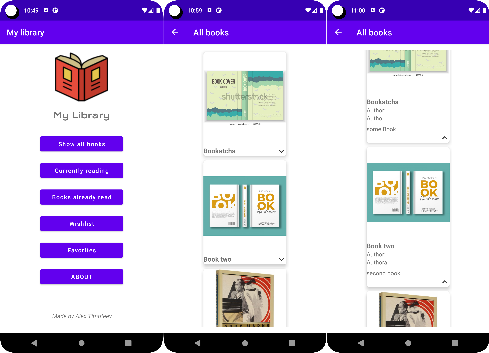
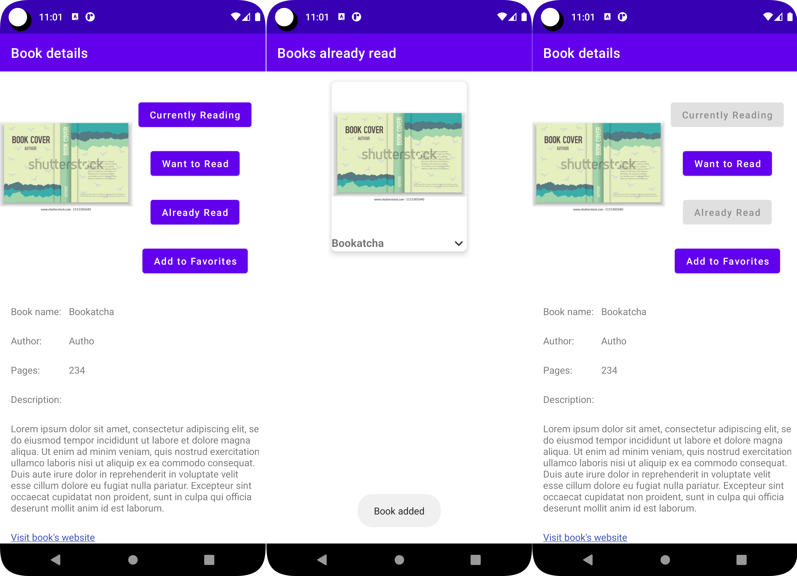
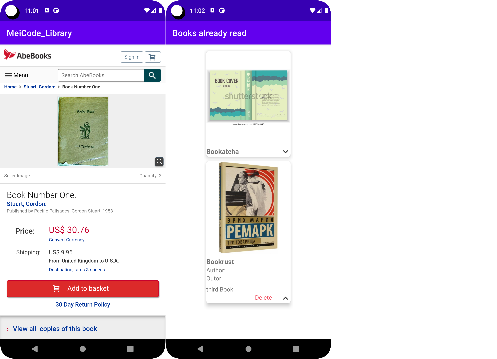

# MeiCode_Library

### Приложение для менеджмента библиотеки книг.
Добавление/удаление из списков (читаю, прочтено, желаемое, избранное).

Данные о том, какая книга в каком списке, сохраняются в SharedPreferences через json с помощью библиотеки Gson.

Для отображения списка открывается отдельная Activity, использующая RecyclerView, содержащий CardView.

Можно перейти на страницу книги в интернете с помощью WebsiteActivity класса.

